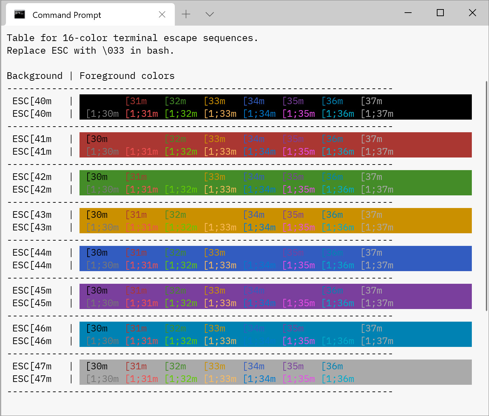

# Alabaster theme for Windows Terminal 🐱‍🐉
A light theme with minimal amount of highlighting for [Windows Terminal](https://github.com/microsoft/terminal).  
Based on the work of [Niki Tonsky Alabaster Theme](https://github.com/tonsky/sublime-scheme-alabaster)

# Installation
For now, the only way to install custom color scheme is to manually copy them into `settings.json` configuration file of Windows Terminal.

# Preview

# License
[MIT License](https://https://github.com/awbv/Windows-Terminal-Alabaster-Scheme/blob/main/LICENSE.txt)
